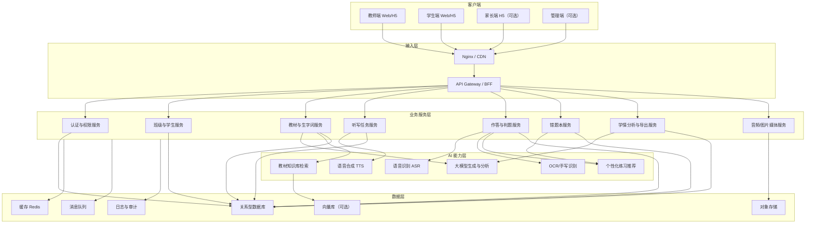
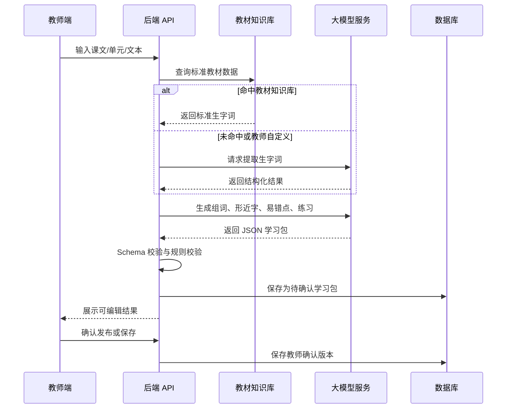
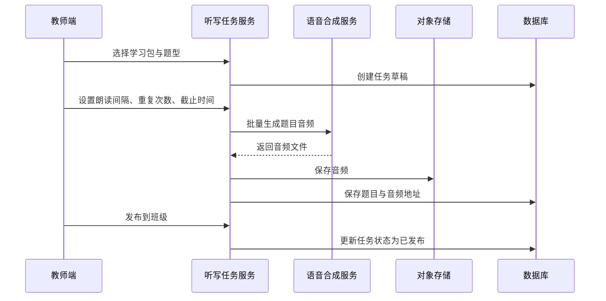
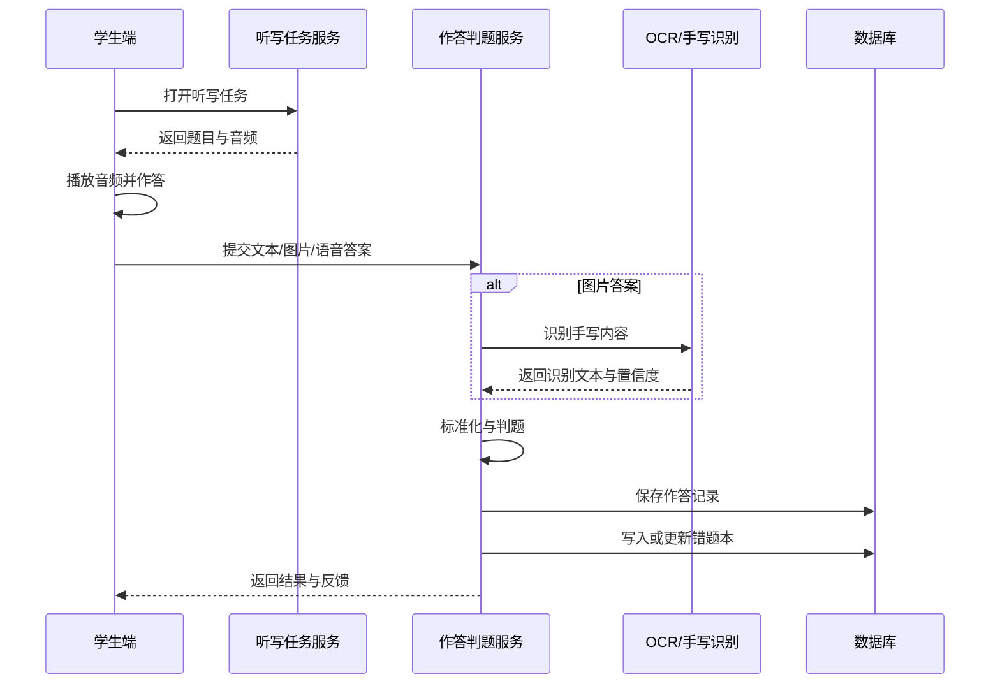
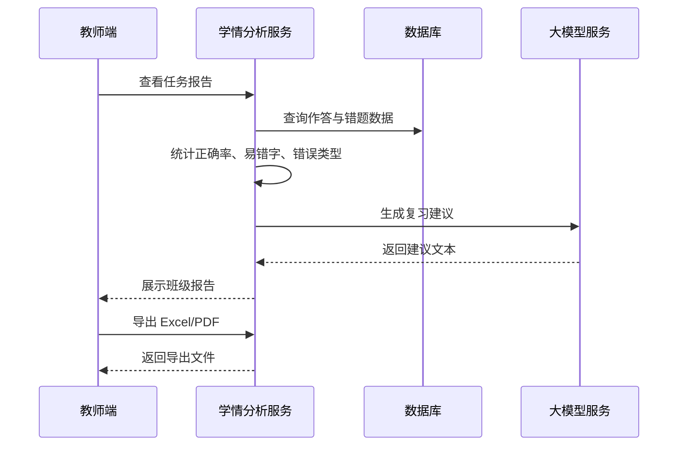
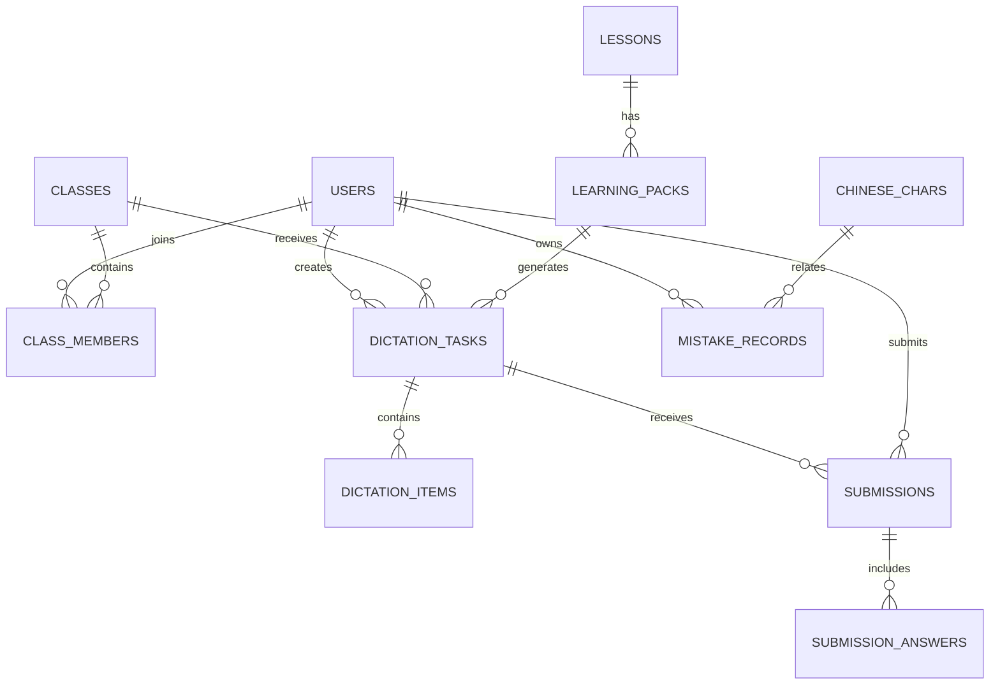

# AI 生字词智能过关小助手技术方案文档

版本：V0.1  
日期：2026-05-19  
关联文档：[AI 生字词智能过关小助手需求文档](./ai_chinese_word_pass_assistant_prd.md)  
适用阶段：参赛原型、MVP 开发、校内试点

## 1. 技术方案概述

### 1.1 建设目标

围绕小学一、二年级语文生字词学习场景，建设一套轻量化 AI 教育小工具。系统通过大模型、语音合成、语音识别、手写识别、OCR、规则判题和学习分析等能力，实现以下闭环：

1. 教师输入课文或单元。
2. AI 自动生成生字词学习包。
3. 教师确认并发布听写任务。
4. 学生完成 AI 语音听写。
5. 系统自动判题并反馈。
6. 错题自动进入个人错题本。
7. 系统推送同类巩固练习。
8. 教师查看班级易错字统计和薄弱字词分析。

### 1.2 技术定位

本项目不是单纯的 AI 聊天应用，而是“AI 能力 + 教材知识库 + 教学业务流程 + 学情数据分析”的垂直微应用。

技术上采用“业务规则优先、AI 增强辅助、人机确认兜底”的设计原则：

- 教材标准内容优先来自结构化知识库。
- AI 负责提取、生成、解释、推荐和分析。
- 判题环节以确定性规则为主，AI 用于错因解释和同类练习生成。
- 对低置信度手写识别结果保留教师复核入口。
- 教师确认后的内容作为正式教学内容。

### 1.3 推荐建设路径

为满足比赛对“可展示、可落地、低门槛”的要求，推荐分两层建设：

- 参赛 MVP：Web/H5 原型 + 后端 API + 大模型内容生成 + 语音听写 + 文本输入判题 + 错题本 + 班级统计导出。
- 增强版本：加入拍照手写识别、口头回答识别、笔顺动画、个性化推荐、教师批量复核和更完整的学情分析。

## 2. 设计原则

### 2.1 轻量化

- 优先采用 Web/H5 形态，教师和学生可通过浏览器或平板访问。
- MVP 阶段不强依赖复杂客户端安装。
- AI 服务采用可替换接口，避免绑定单一模型或厂商。

### 2.2 低门槛

- 教师只需输入课文、单元或粘贴文本即可开始。
- AI 生成结果以可编辑表格呈现，教师不需要理解提示词或模型参数。
- 学生端只保留任务、听写、反馈、错题本等必要入口。

### 2.3 高效率

- 高频字词、语音音频、AI 生成结果均进行缓存。
- 班级统计采用异步任务生成，避免教师等待过长。
- 导出报告采用后台任务处理，完成后通知教师下载。

### 2.4 准确可控

- 生字、拼音、部首、结构、笔画等基础信息优先来自知识库。
- 大模型输出必须符合 JSON Schema，经过程序校验后才能入库。
- AI 生成内容默认处于“待教师确认”状态。
- 判题结果分为“正确、错误、疑似错误、待复核”，避免强行自动判错。

### 2.5 隐私保护

- 学生数据最小化采集。
- 语音、图片、成绩数据限定教学用途。
- 导出报告支持匿名化。
- 不做公开排名，不展示刺激性分数榜。

## 3. 总体技术架构

### 3.1 架构图



### 3.2 分层说明

| 层级 | 主要职责 | 关键技术 |
| --- | --- | --- |
| 客户端 | 教师生成任务、学生听写、错题查看、报告展示 | Web/H5、响应式布局、音频播放、图片上传 |
| 接入层 | 静态资源托管、接口转发、鉴权、限流 | Nginx、HTTPS、API Gateway |
| 业务服务层 | 用户、班级、教材、任务、判题、错题、报告 | FastAPI/NestJS/Spring Boot 均可 |
| AI 能力层 | 内容生成、语音、识别、推荐、分析 | LLM、TTS、ASR、OCR、RAG |
| 数据层 | 结构化数据、缓存、文件、异步任务、日志 | PostgreSQL/MySQL、Redis、对象存储 |

## 4. 技术选型建议

### 4.1 参赛 MVP 推荐栈

| 模块 | 推荐方案 | 选择理由 |
| --- | --- | --- |
| 前端 | React + Vite + TypeScript 或 Vue 3 + Vite | 开发快，组件生态成熟，适合做演示原型 |
| UI | Ant Design / Arco Design / Element Plus | 表格、表单、统计卡片和导出操作开发效率高 |
| 后端 | Python FastAPI | AI 服务集成方便，接口开发轻量，适合快速原型 |
| 数据库 | PostgreSQL 或 MySQL | 支持结构化业务数据，便于统计分析 |
| 缓存 | Redis | 缓存生字包、音频链接、任务状态 |
| 异步任务 | Celery/RQ/Arq 或后端内置任务队列 | 处理 AI 生成、报告导出、批量统计 |
| 对象存储 | 本地 MinIO 或云对象存储 | 保存听写音频、学生上传图片、导出文件 |
| 大模型 | 可接入 DeepSeek、千问、豆包、文心等 | 通过统一适配层封装，可替换 |
| TTS | 云语音合成或浏览器 SpeechSynthesis 兜底 | MVP 可快速实现 AI 朗读 |
| OCR/手写识别 | 第三方 OCR API，MVP 可先用文本输入 | 降低首版识别难度 |
| 报告导出 | ExcelJS/openpyxl + PDF 模板 | 快速生成教师可提交材料 |

### 4.2 低代码/智能体平台方案

如果比赛时间非常紧，可采用“智能体平台 + 轻量前端”的组合：

- 使用 Dify、扣子、文心智能体等平台编排“生字词学习包生成”和“错题巩固练习生成”流程。
- 自研 Web/H5 负责班级、任务、学生作答、错题本和报告展示。
- 后端通过智能体 API 调用内容生成工作流。

优势是开发快，便于展示 AI 工作流；不足是判题、错题和学情数据仍需要自研业务系统承接。

### 4.3 可扩展生产栈

如果后续要从参赛原型升级为校内长期使用工具，可演进为：

- 前端：React/Vue + PWA，支持平板和手机。
- 后端：模块化单体优先，规模扩大后再拆服务。
- 数据库：PostgreSQL + Redis + 对象存储。
- AI 编排：独立 AI Gateway，统一管理模型、提示词、日志、限流和降级。
- 监控：Prometheus + Grafana 或云监控。
- 日志：结构化日志 + 审计日志。

## 5. 核心模块设计

### 5.1 教师端模块

教师端是工具的主要管理入口，包含：

- 班级管理：创建班级、导入学生、维护学生名单。
- 教材选择：选择年级、册次、单元、课文。
- 课文导入：粘贴文本、上传截图、导入自定义词表。
- AI 生成：生成生字表、组词、形近字、易错字、听写清单。
- 内容确认：教师编辑、删除、补充并确认生字词学习包。
- 任务配置：选择题型、听写范围、朗读速度、重复次数、截止时间。
- 任务发布：发布到班级，生成学生访问入口。
- 作答复核：查看疑似错误答案，批量修正确认。
- 学情报告：查看班级正确率、易错字、薄弱学生、复习建议。
- 导出中心：导出 Excel、PDF、图片报告。

### 5.2 学生端模块

学生端强调低龄友好和最短路径：

- 任务列表：展示待完成、已完成、需复练任务。
- AI 听写：播放语音，支持暂停、重听、下一题。
- 作答输入：MVP 支持键盘输入，增强版支持手写板、拍照上传、口头回答。
- 即时反馈：展示正确答案、拼音、部首、结构、易错提醒。
- 错题本：按课文、单元、错误类型查看错字。
- 巩固练习：完成系统推荐的同类题。
- 生字卡片：查看拼音、组词、形近字、笔顺提示。

### 5.3 家长端模块

家长端可作为第二阶段能力：

- 今日练习：查看教师布置的家庭听写。
- 陪练模式：AI 自动读题，家长无需手动念词。
- 错题查看：了解孩子近期高频错字。
- 完成情况：查看是否完成订正与复练。

### 5.4 后台管理模块

后台管理面向学校管理员或项目维护者：

- 教材知识库维护。
- 生字基础数据维护。
- AI 提示词模板管理。
- 模型调用日志查看。
- 敏感内容与异常输出审核。
- 学校、教师、班级基础数据管理。

## 6. 后端服务设计

### 6.1 认证与权限服务

负责用户登录、角色权限和数据访问控制。

角色建议：

- 系统管理员
- 学校管理员
- 教师
- 学生
- 家长

权限规则：

- 教师只能访问自己班级的数据。
- 学生只能访问自己的任务和错题。
- 家长只能访问绑定孩子的数据。
- 管理员可查看汇总数据，但默认不查看学生敏感原始作答。

### 6.2 教材与生字词服务

负责维护教材、课文、生字、词语、形近字、同音字和笔顺基础数据。

主要能力：

- 根据年级、册次、单元、课文查询标准生字。
- 根据教师输入内容进行 AI 提取。
- 对 AI 生成结果进行结构化校验。
- 保存教师确认后的学习包。
- 支持同一课文的校本补充版本。

### 6.3 AI 生成服务

负责统一调用大模型，生成教学内容与练习。

主要能力：

- 生字词学习包生成。
- 形近字和同音字辨析生成。
- 易错点说明生成。
- 巩固练习生成。
- 学情报告文字总结生成。

设计重点：

- 所有 AI 调用经过统一 AI Gateway。
- AI 输出必须为结构化 JSON。
- 每次 AI 调用保存输入、输出、模型、耗时和人工修改记录。
- 支持重试、降级、缓存和人工编辑。

### 6.4 听写任务服务

负责任务创建、发布、题目管理和状态流转。

任务状态：

- 草稿
- 已发布
- 进行中
- 已截止
- 已归档

题目类型：

- 听写字
- 听写词
- 看拼音写词
- 听音选字
- 形近字辨析
- 同音字语境选字

### 6.5 作答与判题服务

负责学生答案接收、识别、比对、判定和错因分类。

判题流程：

1. 接收作答。
2. 根据输入类型进行预处理。
3. 调用 OCR、手写识别或 ASR。
4. 进行标准化处理。
5. 使用确定性规则判题。
6. 对错误答案进行错因分类。
7. 低置信度结果进入教师复核队列。
8. 写入作答记录和错题记录。

### 6.6 错题本服务

负责错题聚合、状态流转和复练计划。

错题状态：

- 未订正
- 已订正
- 待复练
- 已过关
- 反复错误

聚合规则：

- 同一学生、同一字词、同一错误类型可聚合为一条错题记录。
- 每次出错更新出错次数、最近出错时间和来源任务。
- 连续复练正确后更新为已过关。

### 6.7 推荐服务

负责基于错题生成个性化练习。

推荐依据：

- 错字本身。
- 所属课文和单元。
- 错误类型。
- 出错次数。
- 最近出错时间。
- 同偏旁、同音、形近字关系。
- 班级共性薄弱字。

MVP 可采用规则推荐，后续再引入模型排序。

### 6.8 学情分析与导出服务

负责班级统计、学生画像、报告生成和文件导出。

主要能力：

- 班级任务完成率。
- 班级平均正确率。
- 高频错字统计。
- 高频错误类型统计。
- 学生个人薄弱字词。
- 课文或单元掌握情况。
- AI 生成复习建议。
- 导出 Excel、PDF、图片报告。

## 7. 核心业务流程

### 7.1 AI 学习包生成流程



### 7.2 听写任务发布流程



### 7.3 学生听写作答流程



### 7.4 教师查看学情流程



## 8. AI 能力详细设计

### 8.1 AI 能力边界

AI 负责：

- 从文本中提取候选生字词。
- 生成组词、例句、形近字、同音字和易错提醒。
- 根据错题生成同类巩固题。
- 对班级数据生成教学建议。
- 对错误答案生成儿童友好的解释。

AI 不直接负责：

- 最终教材标准答案认定。
- 高风险自动判分。
- 学生隐私数据外泄式分析。
- 不经教师确认的正式教学内容发布。

### 8.2 教材知识库增强 RAG

知识库内容：

- 年级、册次、单元、课文。
- 课后生字与要求会认、会写分类。
- 生字拼音、部首、结构、笔画。
- 标准词语和常见组词。
- 形近字、同音字、易错字规则。
- 教师校本补充内容。

检索策略：

- 结构化查询优先：年级、册次、单元、课文精确匹配。
- 文本相似检索补充：教师只输入课文片段时，通过向量召回可能课文。
- AI 生成只在知识库缺失或需要解释、练习时介入。

### 8.3 学习包生成 Prompt 设计

输入参数：

- 年级
- 册次
- 单元
- 课文标题
- 课文全文或片段
- 教师自定义要求
- 已知标准生字

输出格式必须符合 JSON Schema：

```json
{
  "lesson": {
    "grade": "一年级",
    "volume": "下册",
    "unit": "第一单元",
    "title": "示例课文"
  },
  "characters": [
    {
      "char": "晴",
      "pinyin": "qing2",
      "display_pinyin": "qíng",
      "radical": "日",
      "structure": "左右结构",
      "stroke_count": 12,
      "words": ["晴天", "晴朗"],
      "simple_sentence": "今天是晴天。",
      "confusing_chars": [
        {
          "char": "睛",
          "reason": "睛是目字旁，和眼睛有关；晴是日字旁，和天气有关。"
        }
      ],
      "common_mistakes": ["容易把日字旁写成目字旁"],
      "dictation_level": "basic",
      "needs_teacher_review": false
    }
  ],
  "dictation_items": [
    {
      "type": "word",
      "answer": "晴天",
      "prompt_text": "请写词语：晴天",
      "difficulty": 1
    }
  ],
  "review_notes": []
}
```

校验规则：

- `characters` 中每项必须包含汉字、拼音、部首、结构。
- 组词数量控制在 2-4 个。
- 例句不超过 20 个汉字。
- 输出不得包含不适合低年级的生僻词和复杂解释。
- 与知识库冲突时标记 `needs_teacher_review=true`。

### 8.4 TTS 语音合成方案

用途：

- 听写题目朗读。
- 生字卡片朗读。
- 错题反馈朗读。

实现策略：

- MVP 可使用浏览器内置 SpeechSynthesis 或云 TTS。
- 正式任务发布时建议预生成音频，减少课堂播放延迟。
- 音频按题目维度缓存，重复使用同一字词时无需再次合成。

音频生成文本模板：

- 字词听写：“请写：晴天。”
- 字听写：“请写这个字：晴。晴天的晴。”
- 三段式：“晴，晴天的晴。请写：晴。”
- 形近字辨析：“请选择正确的字：天气很晴朗。”

音频参数：

- 语速：低年级建议 0.85-0.95 倍。
- 声音：标准普通话，音色亲和。
- 间隔：支持 5 秒、8 秒、10 秒。
- 重复：每题支持自动重复 1-2 次。

### 8.5 ASR 语音识别方案

用途：

- 学生口头回答。
- 朗读生字词检测。

MVP 建议：

- 口头回答作为可选增强能力。
- 首版优先实现文本输入判题，保证演示稳定。

增强版流程：

1. 学生点击录音并读出生字或词语。
2. 前端上传音频。
3. 后端调用 ASR。
4. 返回识别文本和置信度。
5. 转换为拼音或标准文本。
6. 与标准答案比对。
7. 低置信度进入“建议重读”或“待教师复核”。

判定规则：

- 字词朗读以音准为主，不评价儿童口音细节。
- 对轻微停顿、重复读音进行容错。
- 对多音字使用当前题目的上下文标准读音。

### 8.6 OCR 与手写识别方案

用途：

- 学生纸笔听写后拍照上传。
- 学生在平板手写区域作答。

MVP 建议：

- 首版可先实现文本输入判题。
- 演示中可预留“拍照上传识别”入口，第二阶段接入 OCR。

增强版流程：

1. 学生上传听写照片。
2. 前端进行基础裁剪、压缩和方向校正。
3. 后端保存原图到对象存储。
4. 调用 OCR/手写识别服务。
5. 获取候选文本、坐标、置信度。
6. 根据题目顺序切分答案。
7. 使用判题服务比对。
8. 低置信度答案进入教师复核。

手写识别结果结构：

```json
{
  "raw_image_url": "https://example.com/object/answer.jpg",
  "items": [
    {
      "question_id": "q_001",
      "recognized_text": "晴天",
      "confidence": 0.91,
      "bbox": [120, 88, 260, 132],
      "candidates": ["晴天", "睛天"]
    }
  ]
}
```

低置信度处理：

- 置信度大于等于 0.90：可自动判题。
- 置信度 0.70-0.90：判题结果标记为疑似，教师可复核。
- 置信度低于 0.70：进入待复核，不直接判错。

阈值可根据试点数据调整。

### 8.7 自动判题方案

判题以规则为主，AI 为辅。

标准化处理：

- 去除首尾空格和无关标点。
- 统一全角半角。
- 统一简体字。
- 拼音统一为带声调数字或标准音调格式。
- 多答案题按标准答案集合匹配。

判题结果：

- `correct`：正确。
- `wrong`：错误。
- `suspected`：疑似错误，需要教师复核。
- `pending_review`：识别置信度低，待教师复核。

字词听写规则：

- 汉字或词语必须精确匹配。
- 对多字词不做随意模糊通过，避免错字漏判。
- 若识别候选中包含标准答案且置信度接近，可标记为疑似而不是直接错。

拼音判题规则：

- 声母、韵母、声调均正确才算完全正确。
- 只错声调时标记为拼音声调错误。
- 多音字按题目上下文标准读音判定。

选择题规则：

- 选项 ID 匹配标准答案即可。
- 可记录误选项，用于形近字混淆分析。

### 8.8 错因分类方案

错误类型枚举：

- `glyph_error`：字形错误。
- `homophone_confusion`：同音字混淆。
- `similar_shape_confusion`：形近字混淆。
- `radical_confusion`：偏旁混淆。
- `pinyin_initial_error`：声母错误。
- `pinyin_final_error`：韵母错误。
- `tone_error`：声调错误。
- `word_usage_error`：词语使用错误。
- `stroke_order_error`：笔顺错误。
- `unknown`：未知错误。

分类策略：

1. 若学生答案在形近字表中，标记为形近字混淆。
2. 若学生答案与标准答案同音，标记为同音字混淆。
3. 若偏旁不同且在偏旁易错规则中，标记为偏旁混淆。
4. 若是拼音题，按声母、韵母、声调分别比对。
5. 规则无法判断时，调用 AI 生成错因建议，但标记为可编辑。

### 8.9 个性化练习推荐方案

MVP 采用规则推荐：

- 错 1 次：推荐原题重练。
- 错 2 次：推荐原字组词和形近字辨析。
- 错 3 次及以上：加入重点复练清单，推送间隔复习。
- 形近字错误：推荐同组形近字选择题。
- 同音字错误：推荐语境选字题。
- 拼音错误：推荐拼音拼读与看拼音写词。

复习间隔建议：

- 第一次错：当天复练。
- 第二次错：次日复练。
- 第三次错：3 天后复练。
- 连续两次复练正确：标记为已过关。

增强版可引入模型排序：

- 根据学生历史正确率预测下次出错概率。
- 优先推荐高频错、近期错、班级共性错。
- 控制每次练习题量，避免低年级学生负担过重。

## 9. 数据库设计

### 9.1 核心实体关系



### 9.2 用户表 users

| 字段 | 类型 | 说明 |
| --- | --- | --- |
| id | string | 用户 ID |
| name | string | 姓名或昵称 |
| role | enum | admin、teacher、student、parent |
| school_id | string | 学校 ID |
| phone | string | 手机号，可选 |
| status | enum | active、disabled |
| created_at | datetime | 创建时间 |
| updated_at | datetime | 更新时间 |

### 9.3 班级表 classes

| 字段 | 类型 | 说明 |
| --- | --- | --- |
| id | string | 班级 ID |
| school_id | string | 学校 ID |
| name | string | 班级名称 |
| grade | string | 年级 |
| teacher_id | string | 班主任或语文教师 ID |
| school_year | string | 学年 |
| status | enum | active、archived |

### 9.4 班级成员表 class_members

| 字段 | 类型 | 说明 |
| --- | --- | --- |
| id | string | 记录 ID |
| class_id | string | 班级 ID |
| user_id | string | 学生 ID |
| student_no | string | 学号，可选 |
| joined_at | datetime | 加入时间 |
| status | enum | active、left |

### 9.5 教材课文表 lessons

| 字段 | 类型 | 说明 |
| --- | --- | --- |
| id | string | 课文 ID |
| grade | string | 年级 |
| volume | string | 上册/下册 |
| unit_no | int | 单元序号 |
| lesson_no | int | 课文序号 |
| title | string | 课文标题 |
| content | text | 课文正文，可选 |
| source | string | 教材来源 |

### 9.6 生字基础表 chinese_chars

| 字段 | 类型 | 说明 |
| --- | --- | --- |
| id | string | 生字 ID |
| char | string | 汉字 |
| pinyin | string | 拼音内部格式，如 qing2 |
| display_pinyin | string | 展示拼音，如 qíng |
| radical | string | 部首 |
| structure | string | 结构 |
| stroke_count | int | 笔画数 |
| stroke_data_url | string | 笔顺数据地址，可选 |
| common_words | json | 常用组词 |
| created_at | datetime | 创建时间 |

### 9.7 课文生字表 lesson_chars

| 字段 | 类型 | 说明 |
| --- | --- | --- |
| id | string | 记录 ID |
| lesson_id | string | 课文 ID |
| char_id | string | 生字 ID |
| requirement | enum | recognize、write、both |
| order_no | int | 课后生字顺序 |
| official_words | json | 官方或教师确认词语 |

### 9.8 易混淆字表 confusing_pairs

| 字段 | 类型 | 说明 |
| --- | --- | --- |
| id | string | 记录 ID |
| char_a | string | 字 A |
| char_b | string | 字 B |
| type | enum | similar_shape、homophone、radical |
| explanation | text | 辨析说明 |
| example | json | 例句或练习 |

### 9.9 学习包表 learning_packs

| 字段 | 类型 | 说明 |
| --- | --- | --- |
| id | string | 学习包 ID |
| lesson_id | string | 课文 ID，可为空 |
| creator_id | string | 创建教师 ID |
| title | string | 学习包名称 |
| source_type | enum | textbook、pasted_text、image、custom |
| status | enum | draft、pending_review、confirmed |
| content_json | json | 生字、组词、形近字、易错点等 |
| ai_generation_id | string | 对应 AI 生成记录 |
| confirmed_at | datetime | 教师确认时间 |

### 9.10 听写任务表 dictation_tasks

| 字段 | 类型 | 说明 |
| --- | --- | --- |
| id | string | 任务 ID |
| class_id | string | 班级 ID |
| teacher_id | string | 教师 ID |
| learning_pack_id | string | 学习包 ID |
| title | string | 任务名称 |
| mode | enum | classroom、homework、review |
| status | enum | draft、published、closed、archived |
| start_time | datetime | 开始时间 |
| deadline | datetime | 截止时间 |
| settings_json | json | 朗读速度、重复次数、题目顺序等 |

### 9.11 听写题目表 dictation_items

| 字段 | 类型 | 说明 |
| --- | --- | --- |
| id | string | 题目 ID |
| task_id | string | 任务 ID |
| item_type | enum | char、word、pinyin、choice、oral |
| prompt_text | string | 题目提示 |
| answer | string | 标准答案 |
| answer_meta | json | 拼音、字 ID、可选答案等 |
| audio_url | string | TTS 音频地址 |
| order_no | int | 题目顺序 |
| difficulty | int | 难度，1-3 |

### 9.12 提交记录表 submissions

| 字段 | 类型 | 说明 |
| --- | --- | --- |
| id | string | 提交 ID |
| task_id | string | 任务 ID |
| student_id | string | 学生 ID |
| status | enum | in_progress、submitted、reviewed |
| total_count | int | 总题数 |
| correct_count | int | 正确数 |
| suspected_count | int | 疑似数 |
| pending_review_count | int | 待复核数 |
| submitted_at | datetime | 提交时间 |

### 9.13 作答明细表 submission_answers

| 字段 | 类型 | 说明 |
| --- | --- | --- |
| id | string | 作答 ID |
| submission_id | string | 提交 ID |
| item_id | string | 题目 ID |
| raw_answer | text | 原始答案 |
| normalized_answer | text | 标准化答案 |
| recognized_text | text | OCR/ASR 识别文本 |
| confidence | decimal | 识别置信度 |
| result | enum | correct、wrong、suspected、pending_review |
| mistake_type | enum | 错误类型 |
| feedback_json | json | 反馈内容 |
| reviewed_by | string | 复核教师 ID |
| reviewed_at | datetime | 复核时间 |

### 9.14 错题记录表 mistake_records

| 字段 | 类型 | 说明 |
| --- | --- | --- |
| id | string | 错题 ID |
| student_id | string | 学生 ID |
| char_or_word | string | 错字或错词 |
| char_id | string | 生字 ID，可选 |
| mistake_type | enum | 错误类型 |
| wrong_count | int | 出错次数 |
| source_item_ids | json | 来源题目 |
| first_wrong_at | datetime | 首次出错时间 |
| last_wrong_at | datetime | 最近出错时间 |
| status | enum | uncorrected、corrected、reviewing、passed |
| next_review_at | datetime | 下次复练时间 |

### 9.15 AI 调用记录表 ai_generation_records

| 字段 | 类型 | 说明 |
| --- | --- | --- |
| id | string | 记录 ID |
| scene | enum | learning_pack、exercise、feedback、report |
| model_provider | string | 模型供应方 |
| model_name | string | 模型名称 |
| prompt_version | string | 提示词版本 |
| input_hash | string | 输入摘要 |
| output_json | json | 输出内容 |
| latency_ms | int | 耗时 |
| status | enum | success、failed、fallback |
| created_by | string | 调用用户 |
| created_at | datetime | 调用时间 |

## 10. API 设计初稿

### 10.1 认证与用户

| 方法 | 路径 | 说明 |
| --- | --- | --- |
| POST | `/api/auth/login` | 登录 |
| POST | `/api/auth/logout` | 退出 |
| GET | `/api/me` | 获取当前用户 |
| GET | `/api/me/permissions` | 获取权限 |

### 10.2 班级与学生

| 方法 | 路径 | 说明 |
| --- | --- | --- |
| GET | `/api/classes` | 查询教师班级 |
| POST | `/api/classes` | 创建班级 |
| POST | `/api/classes/{class_id}/students/import` | 导入学生 |
| GET | `/api/classes/{class_id}/students` | 学生列表 |

### 10.3 教材与学习包

| 方法 | 路径 | 说明 |
| --- | --- | --- |
| GET | `/api/materials/lessons` | 查询课文 |
| GET | `/api/materials/lessons/{lesson_id}` | 查询课文详情 |
| POST | `/api/learning-packs/generate` | AI 生成学习包 |
| GET | `/api/learning-packs/{pack_id}` | 查看学习包 |
| PUT | `/api/learning-packs/{pack_id}` | 编辑学习包 |
| POST | `/api/learning-packs/{pack_id}/confirm` | 教师确认学习包 |

### 10.4 听写任务

| 方法 | 路径 | 说明 |
| --- | --- | --- |
| POST | `/api/dictation-tasks` | 创建任务 |
| PUT | `/api/dictation-tasks/{task_id}` | 修改任务 |
| POST | `/api/dictation-tasks/{task_id}/publish` | 发布任务 |
| GET | `/api/dictation-tasks/{task_id}` | 任务详情 |
| GET | `/api/classes/{class_id}/dictation-tasks` | 班级任务列表 |
| POST | `/api/dictation-tasks/{task_id}/tts` | 生成或刷新音频 |

### 10.5 学生作答

| 方法 | 路径 | 说明 |
| --- | --- | --- |
| GET | `/api/student/tasks` | 学生任务列表 |
| GET | `/api/student/tasks/{task_id}` | 学生获取任务 |
| POST | `/api/student/tasks/{task_id}/submissions` | 创建提交 |
| POST | `/api/submissions/{submission_id}/answers` | 提交单题答案 |
| POST | `/api/submissions/{submission_id}/finish` | 完成提交 |
| GET | `/api/submissions/{submission_id}/result` | 查看结果 |

### 10.6 错题与练习

| 方法 | 路径 | 说明 |
| --- | --- | --- |
| GET | `/api/student/mistakes` | 学生错题本 |
| POST | `/api/student/mistakes/{mistake_id}/review` | 生成复练 |
| POST | `/api/exercises/generate` | 生成同类练习 |
| POST | `/api/exercises/{exercise_id}/submit` | 提交练习 |

### 10.7 教师报告与导出

| 方法 | 路径 | 说明 |
| --- | --- | --- |
| GET | `/api/reports/tasks/{task_id}` | 任务报告 |
| GET | `/api/reports/classes/{class_id}/summary` | 班级汇总 |
| POST | `/api/reports/tasks/{task_id}/export` | 创建导出任务 |
| GET | `/api/export-jobs/{job_id}` | 查询导出状态 |
| GET | `/api/export-jobs/{job_id}/download` | 下载导出文件 |

### 10.8 教师复核

| 方法 | 路径 | 说明 |
| --- | --- | --- |
| GET | `/api/review/pending-answers` | 查询待复核答案 |
| POST | `/api/review/answers/{answer_id}` | 复核单题答案 |
| POST | `/api/review/answers/batch` | 批量复核 |

## 11. 前端交互设计要点

### 11.1 教师端关键页面

AI 学习包生成页：

- 左侧输入区：课文标题、单元、粘贴文本、上传图片。
- 中间生成结果：生字表、组词、形近字、易错点。
- 右侧检查提示：待教师确认项、知识库冲突项。
- 底部操作：重新生成、保存草稿、确认学习包。

听写任务配置页：

- 选择学习包。
- 选择题目范围。
- 设置听写模式。
- 设置朗读速度、重复次数和间隔。
- 预览学生端效果。
- 发布到班级。

报告页：

- 顶部统计：完成率、平均正确率、错题数、复练率。
- 易错字排行。
- 错误类型分布。
- 学生薄弱字词表。
- AI 复习建议。
- 导出按钮。

### 11.2 学生端关键页面

任务列表页：

- 使用大按钮和清晰状态。
- 展示“待完成、已完成、需要复练”。
- 不展示复杂数据表格。

听写页：

- 当前题号。
- 播放、暂停、重听按钮。
- 答案输入区。
- 下一题按钮。
- 可选拍照上传或录音按钮。

反馈页：

- 正确时给出简短鼓励。
- 错误时展示正确答案、拼音、部首和一句易错提醒。
- 提供“再练一次”入口。

错题本页：

- 按课文、单元、出错次数分组。
- 每个错题展示状态：未订正、待复练、已过关。
- 点击进入生字卡片和巩固题。

## 12. 学情分析指标设计

### 12.1 班级维度

| 指标 | 计算方式 | 用途 |
| --- | --- | --- |
| 完成率 | 已提交人数 / 应提交人数 | 判断任务执行情况 |
| 平均正确率 | 全班正确题数 / 全班总题数 | 判断整体掌握情况 |
| 高频错字 | 按错字出现次数排序 | 确定复习重点 |
| 高频错误类型 | 按错误类型统计 | 判断主要薄弱环节 |
| 复练完成率 | 已完成复练人数 / 需复练人数 | 判断错题闭环效果 |
| 单元过关率 | 达到教师设置正确率阈值的人数 / 总人数 | 判断单元掌握情况 |

### 12.2 学生维度

| 指标 | 计算方式 | 用途 |
| --- | --- | --- |
| 个人正确率 | 学生正确题数 / 学生总题数 | 了解个人掌握程度 |
| 反复错字 | 同一字词出错次数大于等于 2 | 生成个性化复习 |
| 错误类型分布 | 按错误类型统计 | 定位学习问题 |
| 最近复练情况 | 近 7 天复练完成与正确情况 | 判断巩固效果 |
| 已过关错题数 | 连续复练正确的错题数 | 反馈进步 |

### 12.3 AI 复习建议生成

输入：

- 班级高频错字。
- 高频错误类型。
- 学生薄弱分组。
- 最近任务正确率。

输出：

- 3-5 条教师可执行建议。
- 每条建议包含复习对象、复习内容、建议时长和题型。

示例：

```json
{
  "suggestions": [
    {
      "target": "全班",
      "focus": "晴、睛、情、请形近字辨析",
      "duration": "5分钟",
      "activity": "偏旁归类 + 语境选字",
      "reason": "本次任务中该组字混淆次数最高"
    }
  ]
}
```

## 13. 安全与隐私设计

### 13.1 数据最小化

- 学生账号可使用姓名或匿名编号，非必要不采集手机号。
- 家长绑定可通过教师发放邀请码完成。
- 听写图片和语音只用于本次判题和教学分析。

### 13.2 数据权限

- 教师只能查看自己班级。
- 家长只能查看绑定学生。
- 学生只能查看本人数据。
- 管理员查看汇总时默认匿名化。

### 13.3 文件安全

- 图片、音频、导出报告存放在对象存储。
- 文件访问使用短期签名 URL。
- 导出文件设置有效期，过期自动清理。

### 13.4 AI 调用安全

- 调用 AI 前对学生姓名等敏感信息做脱敏。
- 不把整班原始身份数据传给大模型。
- 学情建议只传聚合统计数据。
- 保存 AI 调用日志，便于追溯问题输出。

### 13.5 未成年人保护

- 不展示公开排名。
- 错误反馈采用鼓励式语言。
- 不生成带有羞辱、比较、标签化的评语。
- 教师报告使用“需关注”“建议复练”等中性表达。

## 14. 性能与稳定性设计

### 14.1 性能目标

| 场景 | 目标 |
| --- | --- |
| 教师打开任务列表 | 1 秒内返回 |
| 学生进入听写任务 | 2 秒内可开始 |
| 单题文本判题 | 500 毫秒内完成 |
| 学习包 AI 生成 | 30 秒内完成，超时可后台继续 |
| 班级报告生成 | 5 秒内展示基础统计，复杂报告异步生成 |
| Excel 导出 | 30 秒内完成，超大班级异步处理 |

### 14.2 缓存策略

- 教材基础数据缓存。
- 生字详情缓存。
- AI 学习包生成结果按输入 hash 缓存。
- TTS 音频按朗读文本和音色缓存。
- 班级报告按任务 ID 缓存，作答更新后失效。

### 14.3 异步处理

适合异步的任务：

- AI 学习包生成。
- 批量 TTS 音频生成。
- OCR 图片识别。
- 班级报告生成。
- Excel/PDF 导出。

### 14.4 降级策略

- 大模型不可用：允许教师使用知识库标准生字手动创建任务。
- TTS 不可用：使用浏览器本地朗读或文本提示。
- OCR 不可用：切换为学生手动输入。
- 报告导出失败：保留页面统计，可稍后重试。

## 15. 部署方案

### 15.1 参赛演示部署

适合快速展示：

- 前端部署在静态资源服务或本机。
- 后端部署在一台云服务器或本机 Docker。
- 数据库使用 PostgreSQL/MySQL。
- 文件存储使用本地目录或 MinIO。
- AI 服务通过外部 API 调用。

最小部署组件：

```text
frontend
backend-api
database
redis
object-storage
ai-provider-api
```

### 15.2 Docker Compose 结构

建议目录：

```text
deploy/
  docker-compose.yml
  nginx/
  backend/
  frontend/
  postgres/
  redis/
  minio/
```

服务示例：

- `frontend`：提供 Web 静态资源。
- `backend`：提供 API 服务。
- `postgres`：关系型数据库。
- `redis`：缓存与任务队列。
- `minio`：本地对象存储。
- `nginx`：统一入口和反向代理。

### 15.3 校内部署建议

如果进入真实学校试点：

- 全站 HTTPS。
- 数据库定期备份。
- 文件对象存储生命周期管理。
- AI API Key 放入服务端环境变量，不暴露给前端。
- 开启访问日志和操作审计。
- 设置学校级数据隔离字段。

## 16. 测试方案

### 16.1 单元测试

重点覆盖：

- 拼音标准化。
- 汉字答案比对。
- 形近字和同音字错因分类。
- 错题状态流转。
- 报告指标计算。

### 16.2 集成测试

重点覆盖：

- 教师生成学习包。
- 教师发布听写任务。
- 学生完成作答。
- 自动写入错题本。
- 教师查看报告。
- 导出 Excel/PDF。

### 16.3 AI 输出测试

构建小型评测集：

- 10 篇低年级课文样例。
- 100 个常见生字。
- 30 组形近字。
- 30 组同音字。
- 50 条常见错误答案。

评测维度：

- JSON 格式合法率。
- 生字提取准确率。
- 组词适龄性。
- 易错提示正确性。
- 练习题可用率。

### 16.4 OCR/ASR 测试

OCR 测试：

- 清晰拍照。
- 倾斜拍照。
- 光线较暗。
- 低年级不规范手写。
- 多题一页答案。

ASR 测试：

- 标准普通话。
- 儿童语速偏慢。
- 背景噪音。
- 重复读题。
- 多音字上下文。

### 16.5 端到端演示测试

参赛前必须完整跑通：

1. 教师登录。
2. 选择课文。
3. AI 生成学习包。
4. 教师确认发布。
5. 学生听写。
6. 学生答对与答错各至少一题。
7. 错题进入错题本。
8. 系统生成巩固练习。
9. 教师查看报告。
10. 导出报告文件。

## 17. 运维与监控

### 17.1 日志

日志类型：

- 用户操作日志。
- API 请求日志。
- AI 调用日志。
- 判题日志。
- 导出任务日志。
- 异常错误日志。

关键字段：

- 请求 ID。
- 用户 ID。
- 角色。
- 班级 ID。
- 任务 ID。
- 耗时。
- 状态码。
- 错误信息。

### 17.2 指标监控

业务指标：

- 每日活跃教师数。
- 每日活跃学生数。
- 生成学习包数量。
- 发布听写任务数量。
- 完成听写次数。
- 错题复练次数。

技术指标：

- API 平均响应时间。
- API 错误率。
- AI 调用成功率。
- AI 平均耗时。
- TTS 生成耗时。
- OCR/ASR 成功率。
- 导出任务成功率。

### 17.3 告警

建议告警场景：

- AI 调用连续失败。
- API 错误率升高。
- 数据库连接异常。
- 导出任务堆积。
- 对象存储上传失败。
- 磁盘空间不足。

## 18. 迭代计划

### 18.1 第 1 阶段：可演示 MVP

周期：1-2 周

目标：

- 完成教师端学习包生成。
- 完成听写任务发布。
- 完成学生端语音听写。
- 完成文本输入自动判题。
- 完成错题本。
- 完成班级基础统计。
- 完成 Excel 导出。

技术取舍：

- 使用文本输入替代复杂手写识别。
- TTS 可使用浏览器能力或简单云接口。
- 推荐策略使用规则。
- 报告先做基础统计和少量 AI 建议。

### 18.2 第 2 阶段：增强教学闭环

周期：2-3 周

目标：

- 接入 OCR/手写识别。
- 增加教师复核队列。
- 增加同类巩固练习自动生成。
- 完善形近字、同音字、偏旁规则库。
- 增加 PDF 或图片报告。
- 完成演示视频脚本和案例数据。

### 18.3 第 3 阶段：真实试点

周期：4-8 周

目标：

- 接入真实班级名单。
- 完善隐私与权限。
- 优化课堂并发和稳定性。
- 收集教师反馈。
- 根据真实错题数据优化推荐规则。
- 形成参赛应用案例和效果分析报告。

## 19. MVP 功能裁剪建议

### 19.1 必须做

- 教师输入课文或单元。
- AI 生成生字表、组词、形近字、易错字、听写清单。
- 教师确认学习包。
- 语音听写。
- 学生文本输入作答。
- 自动判题。
- 错题自动归集。
- 教师查看班级统计。
- Excel 导出。

### 19.2 可以模拟或半自动

- 手写识别：演示阶段可用预置图片和模拟识别结果。
- 口头回答：可作为视频展示点，不作为主流程依赖。
- 笔顺动画：可先用静态笔顺图或链接。
- 个性化推荐：规则生成即可，不必上复杂模型。

### 19.3 暂不建议首版投入

- 完整家长端。
- 多学校组织架构。
- 积分商城。
- 复杂游戏化。
- 自研手写识别模型。
- 完整教务系统对接。

## 20. 关键风险与技术应对

### 20.1 AI 生成内容不稳定

应对：

- 使用知识库约束。
- 使用 JSON Schema。
- 加入规则校验。
- 保存教师确认版本。
- 允许一键重新生成局部内容。

### 20.2 手写识别误判

应对：

- 引入置信度。
- 对低置信度进入待复核。
- 教师可批量修正。
- MVP 阶段以文本输入保证稳定。

### 20.3 课堂网络不稳定

应对：

- 任务和音频提前缓存。
- 学生答案本地临时保存。
- 支持失败重试。
- 教师端显示提交状态。

### 20.4 模型调用成本不可控

应对：

- 学习包生成结果缓存。
- TTS 音频缓存。
- 报告建议只传统计摘要。
- 常规判题不用大模型。
- 设置每日调用限额。

### 20.5 数据隐私风险

应对：

- 学生身份脱敏。
- AI 调用不传敏感身份信息。
- 导出报告可匿名。
- 文件链接短期有效。
- 设置操作审计日志。

## 21. 参赛展示技术亮点

建议在演示和申报材料中突出以下技术亮点：

- 多模态 AI 融合：文本生成、语音合成、语音识别、OCR/手写识别可形成完整链路。
- 教材知识库增强：不是泛泛生成，而是围绕低年级语文教材进行约束。
- 人机协同可控：AI 生成，教师确认，低置信度结果教师复核。
- 错题闭环：从听写结果自动沉淀到个人错题本，再生成同类巩固练习。
- 学情可视化：自动形成班级易错字统计、薄弱字词分析和复习建议。
- 低门槛部署：Web/H5 即开即用，适合课堂和家庭场景。

## 22. 参赛演示数据建议

为保证现场演示稳定，建议准备一套固定样例：

- 1 个教师账号。
- 1 个一年级班级。
- 8-12 个学生账号或模拟学生。
- 1 篇课文样例。
- 8-10 个生字。
- 2 组形近字，如“晴/睛/情/请”“已/己”。
- 1 组同音字。
- 1 个已发布听写任务。
- 1 份包含正确、错误、疑似错误的作答数据。
- 1 份可导出的班级报告。

演示时建议固定走通：

1. 教师输入课文。
2. AI 生成学习包。
3. 教师发布听写。
4. 学生完成 3 道题。
5. 故意答错形近字。
6. 系统解释错因。
7. 错题进入错题本。
8. 教师看到班级易错字统计。
9. 导出报告。

## 23. 结论

本技术方案采用“Web/H5 前端 + 轻量后端 + 教材知识库 + AI 能力适配层 + 结构化学情数据”的架构，既能满足参赛阶段快速交付和稳定演示，也保留了后续接入手写识别、口头回答、个性化推荐和校内试点的扩展空间。

首版应优先保证完整教学闭环可跑通：AI 生成、教师确认、学生听写、自动判题、错题本、班级统计和导出报告。手写识别、口头回答和笔顺动画可以作为增强能力逐步接入。这样既符合比赛对 AI 技术核心的要求，也能体现真实教学场景中的应用实效。
